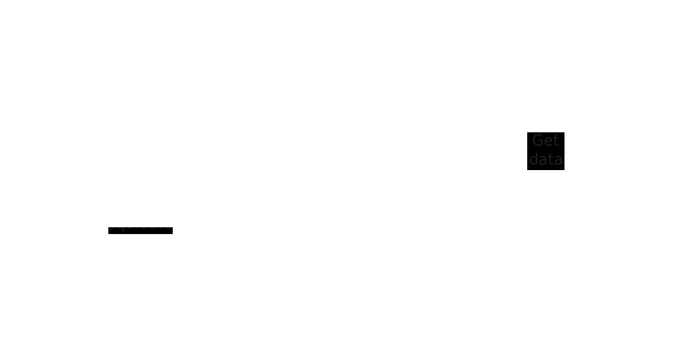

# Fourier Protocol

## 🚧 TODO

## Contract Structure

The Fourier Protocol consists of five smart contracts (with the Interest Model embedded within the Proxy contract):

1. **Oracle**

   The Oracle contract enables smart contracts on the blockchain to access real-world data from off-chain sources. In the lending protocol, it’s primarily used for borrowing and liquidation processes, where it estimates the collateral value of users based on off-chain data.

2. **Fourier Storage**

   This contract is designed to store all relevant data across the protocol’s contracts. Its primary purpose is to prevent data loss during contract upgrades.

3. **Fourier Controller**

   The Fourier Controller manages and coordinates the protocol's various tokens and risk parameters. It acts as the central dispatcher for the money markets, ensuring the stability and security of the entire system.

4. **Interest Model**

   The Interest Model contract calculates the interest rates within the lending market. By dynamically adjusting the rates, it balances supply and demand, ensuring the protocol operates healthily.

5. **Fourier Token Proxy**

   The Proxy contract is used as a technique to simplify contract upgrades and facilitate adding new tokens. This ensures the protocol can be updated or extended without disrupting existing functionality.

## User Flow

